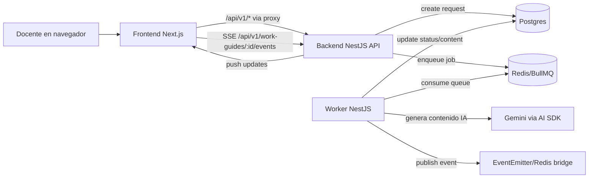

# Mapa Actual Del Proyecto GuiasAI (Arquitectura + Plano Visual)

Este documento describe:
- Como esta conformado el proyecto (codigo y servicios).
- Como esta conformada la interfaz visual (pantallas, posiciones, proporciones y medidas).
- Una guia para poder dibujarlo en papel.

## 1) Estructura del repo (donde esta cada cosa)

```text
GuiasAI/
├─ apps/
│  ├─ frontend/                      # Next.js 16 (UI docente + proxy /api)
│  │  ├─ src/app/
│  │  │  ├─ layout.tsx               # layout raiz + inyeccion runtime env
│  │  │  ├─ page.tsx                 # ruta "/"
│  │  │  ├─ login/page.tsx           # ruta "/login"
│  │  │  ├─ register/page.tsx        # ruta "/register"
│  │  │  └─ api/[...path]/route.ts   # proxy same-origin -> backend
│  │  ├─ src/components/
│  │  │  ├─ auth/                    # layout visual login/register
│  │  │  ├─ workspace/               # shell principal y modos de trabajo
│  │  │  └─ work-guide/              # vista del documento y actividades
│  │  ├─ src/services/               # cliente API y SSE
│  │  └─ src/app/globals.css         # tema visual global + tokens
│  └─ backend/                       # NestJS API + cola + worker logic
│     ├─ src/main.ts                 # arranque API
│     ├─ src/worker.ts               # arranque worker
│     ├─ src/app.module.ts           # DI API
│     ├─ src/worker.module.ts        # DI worker
│     ├─ src/infrastructure/http/controllers/
│     │  ├─ auth.controller.ts       # auth endpoints
│     │  ├─ work-guide.controller.ts # guias + SSE
│     │  └─ health.controller.ts     # healthz/readyz
│     ├─ src/infrastructure/queue/   # BullMQ producer + processor
│     └─ src/infrastructure/ai/      # pipeline y generacion con Gemini
├─ packages/
│  └─ schemas/                       # contrato Zod compartido (frontend/backend)
├─ docker-compose.prod.yml           # stack prod completo
└─ README.md                         # guia operativa principal
```

## 2) Arquitectura runtime (servicios y flujo real)

### 2.1 Servicios en produccion (compose)
- `frontend` (Next.js): puerto `3000`
- `backend` (NestJS API): puerto `3001`
- `worker` (Nest app context): sin puerto publico
- `postgres`
- `redis`

### 2.2 Flujo funcional



## 3) Sistema visual global (base para medidas)

### 3.1 Tokens y fondo
- Radio base: `--radius: 1.35rem` (21.6px)
- Fondo: gradientes radiales + lineal, con grilla sutil fija.
- Tipografia:
  - Display: `Litterata`
  - Body: `Source Sans 3`

### 3.2 Breakpoints usados (Tailwind default, no override detectado)
- `sm`: 640px
- `md`: 768px
- `lg`: 1024px
- `xl`: 1280px
- `2xl`: 1536px

### 3.3 Contenedor maestro del workspace
- `max-w-7xl` -> `80rem` (~1280px)
- Padding:
  - base: `px-4` (16px), `py-5` (20px)
  - `sm`: `px-6` (24px)
  - `lg`: `px-8` (32px), `py-8` (32px)

## 4) Plano visual por pantalla (suficiente para dibujar)

## 4.1 Login / Register (`/login`, `/register`)

### Composicion
- Lienzo centrado vertical/horizontal: `min-h-[100dvh]`
- Grid principal `hero-grid`:
  - mobile: 1 columna
  - >=1080px: `1.12fr / 0.88fr`, gap fluido
- Columna izquierda: bloque editorial (`studio-shell`).
- Columna derecha: card de formulario (`paper-panel`).

### Medidas clave
- Contenedor: `max-w-6xl` -> `72rem` (~1152px)
- Card auth:
  - `rounded-[2rem]` (32px)
  - header `px-5 py-6`, en `sm` -> `px-7`
- Inputs:
  - alto `h-12` -> 48px
  - radio `rounded-[1rem]` -> 16px
- Boton submit: `h-12`, `rounded-full`

### Boceto rapido
```text
+--------------------------------------------------------------+
|                hero-grid (max 1152px)                       |
|  +------------------------------+  +----------------------+  |
|  | Panel editorial              |  | Card acceso seguro   |  |
|  | (texto, 3 chips)             |  | title + form fields  |  |
|  |                              |  | submit + footer      |  |
|  +------------------------------+  +----------------------+  |
+--------------------------------------------------------------+
```

## 4.2 Shell principal (`/`)

### Header superior fijo del contexto
- Card tipo `studio-shell`, `rounded-[1.8rem]`.
- Contiene:
  - Kicker de modo (`Estudio`, `Biblioteca`, etc)
  - Titulo (tema)
  - Meta (`curso / idioma / bloques`)
  - Badge usuario + boton cerrar
  - Tabs `Crear` / `Biblioteca`

### Dimensiones
- Ancho maximo total: 1280px.
- Padding header: `px-5 py-5`, en `sm` `px-6`.
- Chips/tabs con `rounded-full`.

## 4.3 Modo "Generator"

### Layout
- Grid `xl` de 2 columnas:
  - Izquierda: `minmax(0,1.15fr)`
  - Derecha: `minmax(20rem,0.85fr)` (minimo 320px)
- Mobile/tablet: una sola columna apilada.

### Panel izquierdo (formulario)
- Secciones:
  1. Tema/curso/idioma.
  2. Presets sugeridos.
  3. Personalizacion de catalogo.
  4. Error (si aplica).
  5. CTA "Generar guia".
- Alturas clave:
  - Inputs/select: `h-12` (48px)
  - Input cantidad por actividad: `h-9 w-20` (36px x 80px)

### Panel derecho (resumen)
- `xl:sticky xl:top-6`
- Resumen de tema, curso, numero de actividades y puntaje estimado.

### Boceto rapido
```text
Desktop XL:
+---------------------------------------------------------------+
| [Header shell]                                                |
+---------------------------------------------------------------+
| +--------------------------------------+ +------------------+ |
| | Form card (1.15fr)                   | | Resumen sticky   | |
| | - Tema / Curso / Idioma              | | (min 320px)      | |
| | - Presets                            | |                  | |
| | - Catalogo (opcional)                | |                  | |
| | - CTA Generar                        | |                  | |
| +--------------------------------------+ +------------------+ |
+---------------------------------------------------------------+
```

## 4.4 Modo "Generating"

### Layout
- Una card grande, sin split principal.
- Cabecera en grid `lg`:
  - izquierda `1fr` (texto de estado)
  - derecha `minmax(18rem,0.42fr)` (tarjeta tema)
- Barra de progreso fija al `66%` visual.
- 3 bloques de pasos (done/current/upcoming).

## 4.5 Modo "History"

### Layout
- Card principal con header + filtros.
- Grid de tarjetas:
  - base: 1 columna
  - `md`: 2 columnas
  - `2xl`: 3 columnas

### Tarjeta de guia
- Radio: `rounded-[1.9rem]`
- Cubierta superior con gradiente dinamico por estado/tema.
- Seccion inferior con metadatos (fecha/puntaje), estado y acciones.

## 4.6 Modo "Preview" (mesa de revision)

### Layout
- Grid `xl`:
  - izquierda `1.22fr` (documento)
  - derecha `minmax(22rem,0.78fr)` (inspector)
- Sidebar derecha sticky en `xl`.

### Panel documento (izquierda)
- Card externa (`paper-panel`)
- Marco interior doble:
  - contenedor `rounded-[2rem]`
  - hoja interna `rounded-[1.65rem]`
- Dentro va `WorkGuidePreview`.

### Panel inspector (derecha)
- Card con bloques de metadatos:
  - tema, curso, idioma, puntaje, estado revision.

## 4.7 Dialogo de plantillas

- Modal centrado (`DialogContent`) `max-w-3xl` (~768px).
- Grid `lg` 2 columnas:
  - izquierda `0.9fr` (contexto actual)
  - derecha `minmax(20rem,0.7fr)` (guardar/cargar plantillas)
- Altos variables segun cantidad de plantillas.

## 4.8 Plano del documento imprimible (PDF)

### Base
- Contenedor: fondo blanco, tipografia Arial para impresion.
- `@page`: A4 portrait, margen `12mm`.
- Soporta:
  - 1 o 2 columnas de actividades.
  - modo compacto.
  - rubrica opcional.
  - bloque de firma/calificacion opcional.

### Header de hoja (tabla)
- Bloque superior con borde negro:
  - izquierda: logo `w-1/4`, `min-h-24`
  - derecha: info institucional `w-3/4`
- Filas:
  1. nombre/lema/tipo documento
  2. materia + grado
  3. periodo + fecha
  4. docente (fila completa)
  5. estudiante (opcional, fila completa)

### Instrucciones y competencia
- Bloque en 2 columnas `w-1/2 + w-1/2`, borde central.

### Actividades
- Si `twoColumns=true`:
  - `grid-cols-1`, en `sm` y print -> `grid-cols-2`, `gap-4`
- Cada actividad:
  - caja con borde y padding
  - titulo con numeracion y puntaje
  - renderer segun tipo

## 5) API funcional (resumen practico)

### Auth
- `POST /api/v1/auth/register`
- `POST /api/v1/auth/login`
- `POST /api/v1/auth/logout`
- `GET /api/v1/auth/me`

### Guias
- `GET /api/v1/work-guides`
- `POST /api/v1/work-guides`
- `GET /api/v1/work-guides/:id`
- `POST /api/v1/work-guides/:id/retry`
- `POST /api/v1/work-guides/:id/review`
- `SSE /api/v1/work-guides/:id/events`

### Health
- `GET /healthz`
- `GET /readyz`

## 6) Guia para dibujarlo en papel (paso a paso)

1. Dibuja un rectangulo de pagina y marca un ancho util de 1280px equivalente.
2. Traza arriba el header shell (ancho completo, alto variable).
3. Para modo Generator:
   - divide en 2 columnas en desktop (57/43 aprox con min 320px derecha).
4. Para modo Preview:
   - divide en 2 columnas (61/39 aprox con min 352px derecha).
5. Para History:
   - dibuja una grilla de tarjetas 1xN, 2xN (md), 3xN (2xl).
6. Para PDF:
   - dibuja tabla header: 25% logo + 75% datos.
   - debajo, bloque 50/50 instrucciones/competencia.
   - cuerpo en 1 o 2 columnas de actividades.

## 7) Limites de precision (sin inventar)

- Los anchos con `fr` son proporcionales y dependen del viewport real.
- Muchas alturas son de contenido (texto variable), no fijas.
- Medidas en px dadas arriba son exactas solo cuando vienen de clases fijas (`h-12`, `w-20`, `max-w-*`, `rounded-*`).

